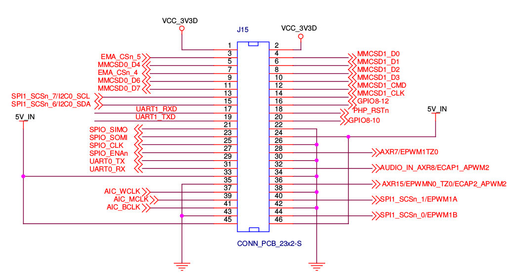
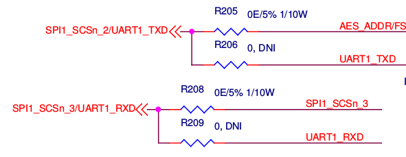

# Interfacing OMAP L-138 with XBEE

## Relevant documentations

**OMAP L-138 Technical Reference**  http://www.ti.com/lit/ug/spruh77a/spruh77a.pdf
**OMAP-L138 C6000 DSP+ARM Processor Datasheet** http://www.ti.com/lit/ds/symlink/omap-l138.pdf
**DSP Megamodule Reference Guide** http://www.ti.com/lit/pdf/sprufk5
**C674x DSP CPU and ISA Reference Guide** http://www.ti.com/cn/lit/pdf/sprufe8
**LCDK Schematics** http://processors.wiki.ti.com/index.php/OMAP-L138_LCDK_Schematic_Companion
**OMAP Starterware** http://www.ti.com/tool/starterware-dsparm

## Problem Definition

We need to replace the TM4C XBEE receiver with a OMAP L-138 module.


## Analysis

The `LCDK_Support_DSP.c` file included in the Real Time DSP software package provides useful functions to interact with UART2.

```cpp
void   Init_UART2(Uint32);
void   Write_UART2(Uint8);
void   Puts_UART2(char *);
Uint8  Read_UART2();
Uint8  IsDataReady_UART2();
Uint8  IsTxReady_UART2();
```

However, we can notice, this set of functions

- do not allow interrupt for an efficient interfacing
- only uses UART2

When we look at the schematics

We notice both UART0 and 1 are represented on the connection poart **but no UART2**. Modification is thus necessary to port the codes above into UART2.

## Implementation Plan

I want to do this in 2 steps.

1. enable interrupt and test a simple UART echo on the UART2-USB interface with PC.
2. port everything into UART0. (or 1, it doesn't matter).

## UART2 USB Echo

To do this I need to find out these info

- where on the interrupt vector table is UART2 interrupt (might as well find UART0 and 1 too)
- The pin may be multiplexed with something, how do I enable these pins if need to? 
- what interrupt priority level (channel) should I assign?

### Interrupt on OMAP L-138

First we configure UART2 as follows. ERBI is found in [**Technical Ref P.1500**] which supposedly enables "Receiver data available interrupt and character timeout indication interrupt enable".

```cpp
pUART->iir_fcr = 0x0000;		// disable FIFO, clear Tx and Rx FIFO
pUART->ier = UART_IER_ERBI;     // enable Rx FIFO line interrupt
```

IT turns out OMAP L-138 employs a very complex interrupt handling mechanism. On the DSP mega-module, there are 12 interrupt channels. (`INT4`-`INT15`), which can map to 124 possible system events [**DSP Megamodule Reference P.166**]. For example, system event "McASP0 irq" is apparently **61**. EDMA3_CC0_INT1 irq is **8** and is mapped to `INT8` by default. The table of system event assignments are found in the **Datasheet P.100**. 

According to the data sheet

| Interrupt | IRQ Event Mapping number |
|-----------|--------|
| UART0_INT | 38     |
| UART1_INT | 46     |
| UART2_INT | 69     |

With this information we should map number 69 to an arbitrary INT channel, I will go ahead and use `INT4` because it doesn't require shifting.

```cpp
intc->intmux1 = 0x07060500 | 69;
```

After that we need to enable `INT4` in `IER` [**DSP CPU & ISA ref P.42**]

```cpp
IER |= 0x0010;
```

After that, go to `vector.asm` and add the corresponding ISR to the vector table.

```
    .ref    _UART2_ISR

INT4:   b _UART2_ISR
```

And supply a `UART2_ISR`. I am not sure whether acknowledgement is required.

The result is successful. I can set up a UARTEcho on the UART2-USB channel with the PC.

## Port the UARTEcho onto UART0

Unfortunately, UART2 does not have a output digital port that multiplexes with it. Therefore it is necessary to output through UART0.

### Foreseeable challenge

- Will there be multiplexing on the digital port? How can we enable it?
- How can we test whether this code works?
	- maybe we can test using Oscilloscope

### Implementation

First we trivially substitue all instances of `UART2` with `UART0`, including changing the event mapping number from 69 to 38.

```cpp
intc->intmux1 = 0x07060500 | 38;
```

This now builds. We then rely on the **LCDK Schematics P.12** to find the correct pins on the bus.



According to this

| Pin        | Number |  Color |  XBEE pin |
|------------|--------|--------|-----------|
| 3.3 V      |    1   | White  |   VCC     |
| Ground     |   43   |  Black |   GND     |
| UART1_RXD  |   17   | -- |   DOUT    |
| UART1_TXD  |   19   |
| UART0_TXD  |   29   |
| UART0_RXD  |   31   | -- |   DOUT    |

However, attempts to access the UART0 pin does not yield anything. The UART0 interrupt will actually be triggered **once** wheter or not connected directly to the XBEE module. Using digital analyzer to inspect the TX pin when transmitting also does not see any signals out of it.

It seems what has to be added to the equation is the **PINMUX** register as expected. The pins with UART0 are listed as as the higher 4 nibbles in **PINMUX3** register [**Technical Reference P.250**]. Inspecting the code ` platform/lcdkOMAPL138/uart.c` inside the OMAP Starterware, we see all four pins must be enabled. (`RTS`, `CTS`, `TXD`, `RXD`) So this is what we will do.

```cpp
PINMUX3 = (PINMUX3 & ~0xFFFF0000) | 0x22220000;
```
However, the test still doesn't yield anything. The UART0 interrupt is still triggered once, but not anymore.

##  Horror ahead

I saw this discussion thread when searching online. I am hoping it is not true.
https://e2e.ti.com/support/dsp/omap_applications_processors/f/42/t/200681#pi317270=2

> Summary:
>
> To enable UART1:
> 
> Remove R205, R208
> Short R206, R209
> 
> To enable UART0:
> 
> Remove R172, R173, R277
> Short R218, R219
> 
> This will probable disable the ethernet module and the SPI for the fingerprints module so beware. 

And indeed it seems coherent from what the schematics say



## Struggle

Removing surface mounted parts from a circuit board is probably beyond the ability of our team. What I will try is then.

- try if UART1 is somehow different
	- if the above post is true that is not the case. Although there are fewer resistors (4) associated with UART1 so that might be an advantage
- Use UART2 which already works, and connect it via USB to another board.

### What about UART1?

porting from UART0 to UART1 is again simple.

- trivially substitue all occurrences of UART0 with UART1
- Change the event number from `38` to `46`
- enable `UART1_RXD` and `TXD` on `PINMUX4`
- connect `DOUT` to pin 17 instead of 31

```cpp
PINMUX4 = (PINMUX4 & ~0xFF000000) | 0x22000000;
```

The testing result says no. Interestingly, in the case of `UART1` the interrupt doesn't even fire.

### Connect boards via UART USB

For this Katie and Katelyn will purchase a USB hub, so we can connect the UART2 directly to USB . My only fear is if this USB hub doesn't actually do what it does.