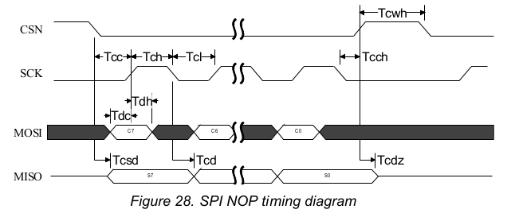

# TM4C123G interface to nFR24L01\+ module

## Related documentation
[NFR24L01+ Official product specification](http://www.nordicsemi.com/eng/nordic/download_resource/8765/2/59617910)
[Electronicos Caldas guide](http://www.electronicoscaldas.com/datasheet/RFM01_ElecFreaks.pdf) provides a guide in plain English.

## Physical connection

The chip is in a package of pluggable 8 pins:

| nFR24 pin               | MCon pin       | color   |
|-------------------------|----------------|---------|
| 1. GND                  |  GND           |  Black  |
| 2. VCC                  |  3.3 V         |  White  |
| 3. CE                   |  PA6           |  Red    |
| 4. CSN                  |  SSI0FSS (PA3) |  Blue   |
| 5. SCK                  |  SSI0CLK (PA2) |  Yellow |
| 6. MOSI (MCU to nFR24)  |  SSI0Tx  (PA5) |  Green  |
| 7. MISO (nFR24 to MCU)  |  SSI0Rx  (PA4) |  Orange |
| 8. IRQ                  |  PA7           |  Brown  |

## Using resources on TM4C
- SSI0

The timing as desbribed by the following timing diagram

corresponds roughly to the **Freescale SPI Frame Format with SPO=0 and SPH=1** on TM4C board.

