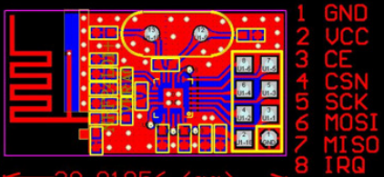

# TM4C123G interface to nFR24L01\+ module

## Related documentation
[Electronicos Caldas guide](http://www.electronicoscaldas.com/datasheet/RFM01_ElecFreaks.pdf) provides a guide in plain English.

## Physical connection

The chip is in a package of pluggable 8 pins:

| nFR24 pin | MCon pin | color    |
|-----------|----------|----------|
| 1. GND    |  GND     |
| 2. VCC    |  3.3 V   |
| 3. CE     |          |
| 4. CSN    |          |
| 5. SCK                  |  SSI0CLK (PA2) |
| 6. MOSI (MCU to nFR24)  |  SSI0Tx  (PA5) |
| 7. MISO (nFR24 to MCU)  |  SSI0Rx  (PA4) |
| 8. IRQ    |  GND        |

## Using resources on TM4C
- SSI0